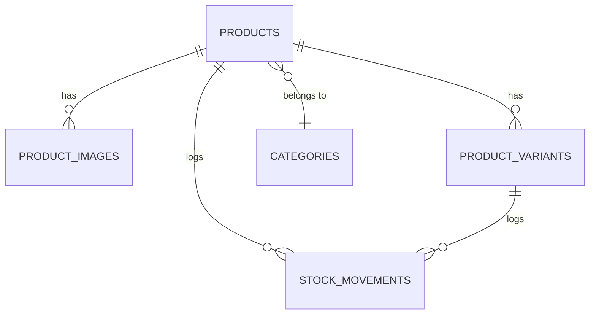
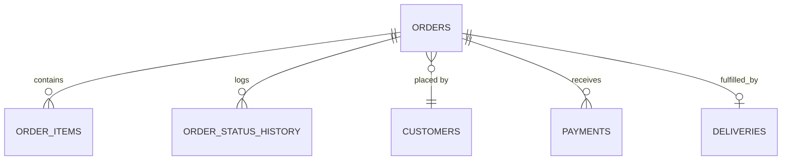

# Database ERD & Table Specification

All tables use `id` (bigint, auto-increment, PK) unless noted. All use `created_at`/`updated_at`. `business_id` (FK → businesses.id, indexed) marks a tenant-scoped table — every such table is covered by the `BelongsToBusiness` global scope (see [02-multitenancy.md](02-multitenancy.md)). `uuid` (ULID, unique, indexed) is added to any model exposed in a public URL or to customers/riders (never expose raw incrementing IDs — spec §15).

## 1. Platform / Auth

```mermaid
erDiagram
    USERS ||--o{ BUSINESS_USERS : "belongs to businesses"
    BUSINESSES ||--o{ BUSINESS_USERS : "has staff"
    ROLES ||--o{ BUSINESS_USERS : "assigned via"
    ROLES ||--o{ ROLE_PERMISSIONS : has
    PERMISSIONS ||--o{ ROLE_PERMISSIONS : granted

    USERS {
        bigint id
        string name
        string email
        string phone
        string password
        timestamp email_verified_at
        boolean is_super_admin
        softDeletes
    }
    BUSINESSES {
        bigint id
        ulid uuid
        string name
        string slug "unique, store URL"
        string owner_user_id FK
        string phone
        string whatsapp_number
        string email
        string category
        string region
        string district
        string ward
        string logo_path
        string status "trial|active|suspended|cancelled"
        json settings
        softDeletes
    }
    BUSINESS_USERS {
        bigint id
        bigint business_id FK
        bigint user_id FK
        bigint role_id FK
        boolean is_owner
        string status "active|suspended"
        unique "business_id,user_id"
    }
    ROLES { bigint id "global: owner,manager,sales_staff,stock_manager,accountant,rider,super_admin" string name string guard }
    PERMISSIONS { bigint id string name "module.action e.g. products.delete" }
    ROLE_PERMISSIONS { bigint role_id FK bigint permission_id FK }
```

Notes:
- `roles`/`permissions`/`role_permissions` are implemented via `spatie/laravel-permission` (pending approval D2) — table names above map 1:1 to that package's `roles`, `permissions`, `role_has_permissions` tables, plus our own `model_has_roles` scoped per business via a custom pivot (`business_users.role_id`) rather than the package's global model-role pivot, because a user can hold **different roles in different businesses**.
- A `user` with `is_super_admin = true` is platform staff; they never appear in any `business_users` row and are routed to the Super Admin console only.

## 2. Business profile & structure

| Table | Key columns | Notes |
|---|---|---|
| `business_profiles` | business_id, description, website, social_links(json), tax_number, tax_enabled(bool), tax_rate(decimal), registration_number | 1:1 with businesses |
| `business_settings` | business_id, currency(default TZS), timezone(default Africa/Dar_es_Salaam), locale(default sw), invoice_prefix, receipt_prefix, low_stock_default_threshold | 1:1 with businesses |
| `branches` | business_id, name, region, district, ward, phone, is_default | V1: informational + staff-assignment only, **not** per-branch stock (see D5 in ambiguities doc) |
| `business_hours` | business_id, branch_id nullable, day_of_week, opens_at, closes_at, is_closed | |

## 3. Products & Inventory



| Table | Key columns | Notes |
|---|---|---|
| `categories` | business_id, name, slug, parent_id nullable | self-referencing for simple sub-categories |
| `products` | business_id, uuid, category_id, name, sku, description, selling_price(unsignedBigInteger, TZS), cost_price, stock_quantity, low_stock_threshold, image_path, is_featured(bool), status(active/archived), has_variants(bool), softDeletes | `stock_quantity` is a cached/denormalized total, source of truth is `stock_movements` |
| `product_images` | product_id, path, sort_order | |
| `product_variants` | product_id, sku, attributes(json e.g. {"size":"M","color":"Black"}), price nullable(overrides parent), stock_quantity, low_stock_threshold | |
| `stock_movements` | business_id, product_id, variant_id nullable, type(purchase/opening/sale/return/damaged/adjustment/transfer), quantity(signed int), reference_type/reference_id(morphs to order/return/manual), note, created_by | Immutable ledger — never update, only insert; `products.stock_quantity` recomputed/synced on write |
| `stock_adjustments` | business_id, product_id, variant_id nullable, before_quantity, after_quantity, reason, created_by | User-facing "manual adjustment" record, also emits a `stock_movements` row of type `adjustment` |

## 4. Customers

| Table | Key columns | Notes |
|---|---|---|
| `customers` | business_id, uuid, name, phone(indexed, dedup key per business), email nullable, region, district, area, status | Guest checkout on the public store creates/matches a customer by `(business_id, phone)` |
| `customer_addresses` | customer_id, label, region, district, ward, area, landmark, is_default | |
| `customer_notes` | customer_id, note, created_by | Staff-visible only, never shown to customer |

## 5. Orders



| Table | Key columns | Notes |
|---|---|---|
| `orders` | business_id, uuid, order_number(e.g. `ORD-2026-000123`, unique per business), customer_id, source(pos/online_store/whatsapp), subtotal, discount_amount, discount_type(fixed/percentage), tax_amount, delivery_fee, total, amount_paid(cached), status, notes, created_by | **All monetary fields are server-recalculated on every write; client never supplies `total`** |
| `order_items` | order_id, product_id, variant_id nullable, product_name_snapshot, sku_snapshot, unit_price, quantity, line_total | Snapshots protect historical accuracy if a product is later edited/archived |
| `order_status_history` | order_id, from_status, to_status, changed_by, note | One row per transition, per spec §26 |

Order statuses (spec §26, enforced via a status machine, not free text): `draft, pending_payment, paid, processing, ready, assigned, out_for_delivery, delivered, completed, cancelled, refunded`.

## 6. Payments

| Table | Key columns | Notes |
|---|---|---|
| `payment_methods` | business_id nullable(null = platform default), name(cash/mpesa/airtel_money/mixx_by_yas/halopesa/bank/other), is_active | Business can enable/disable which methods it accepts |
| `payments` | business_id, uuid, order_id nullable, invoice_id nullable, amount, method_id, reference, status(pending/confirmed/failed/refunded), paid_at, notes, recorded_by | Implemented through `PaymentServiceInterface` → `ManualPaymentService` (see [06](06-folder-structure-service-architecture.md)) |

## 7. Invoices & Receipts

| Table | Key columns | Notes |
|---|---|---|
| `invoices` | business_id, uuid, invoice_number(`INV-2026-000001`, unique per business, sequential per business via a `business_settings` counter), order_id, customer_id, issue_date, due_date, subtotal, discount_amount, tax_amount, delivery_fee, total, amount_paid, balance, status(unpaid/partially_paid/paid/overdue/void), notes, terms | |
| `invoice_items` | invoice_id, description, quantity, unit_price, line_total | Mirrors order_items at time of invoice generation |
| `receipts` | business_id, uuid, receipt_number(`RCT-2026-000001`), invoice_id nullable, payment_id, customer_id, amount, method_id, transaction_reference, issued_at | |
| `receipt_items` | receipt_id, description, quantity, unit_price, line_total | |

## 8. Expenses

| Table | Key columns | Notes |
|---|---|---|
| `expense_categories` | business_id nullable(null = platform default: rent, electricity, salaries, transport, delivery, marketing, stock_purchase, internet, maintenance, misc), name | |
| `expenses` | business_id, category_id, amount, date, description, method_id, attachment_path, created_by | |

## 9. Delivery

| Table | Key columns | Notes |
|---|---|---|
| `delivery_zones` | business_id, name(e.g. Mikocheni) | |
| `delivery_fees` | business_id, zone_id nullable(null = default/manual), fee_type(fixed/zone/manual), amount | |
| `riders` | business_id, uuid, name, phone, photo_path, status(active/inactive/suspended), user_id nullable(if rider has portal login) | |
| `deliveries` | business_id, uuid, order_id, rider_id nullable, zone_id nullable, delivery_fee, status(pending/assigned/accepted/picked_up/out_for_delivery/delivered/completed/failed), assigned_at, picked_up_at, delivered_at | |
| `delivery_status_history` | delivery_id, from_status, to_status, changed_by, note | |

## 10. Online Store

| Table | Key columns | Notes |
|---|---|---|
| `store_settings` | business_id, is_active(bool), theme(basic), banner_path, show_out_of_stock(bool), seo_title, seo_description, indexable(bool) | |
| `carts` | business_id, uuid, session_id nullable, customer_id nullable, status(open/converted/abandoned) | Guest cart keyed by session until checkout |
| `cart_items` | cart_id, product_id, variant_id nullable, quantity, unit_price_snapshot | |
| `checkout_sessions` | business_id, cart_id, customer_payload(json: name/phone/address before customer record exists), status(pending/completed/expired), order_id nullable | |
| `store_visits` | business_id, product_id nullable, session_id, referrer, created_at only | Lightweight analytics, high-volume table — no `updated_at`, pruned periodically |

## 11. Notifications

| Table | Key columns | Notes |
|---|---|---|
| `notifications` | business_id, user_id nullable(null = business-wide), type(new_order/payment_received/low_stock/...), title, body, data(json), read_at | In-app bell |
| `notification_logs` | business_id, channel(whatsapp/sms/email), recipient, type, provider, provider_message_id, status(queued/sent/delivered/failed), error, payload(json) | Every outbound WhatsApp/email/SMS attempt logged here regardless of provider (spec §45) |

## 12. Subscriptions

| Table | Key columns | Notes |
|---|---|---|
| `plans` | uuid, name(Starter/Business/Pro), price(TZS), billing_interval(monthly), is_active, sort_order | Platform-level, managed by Super Admin — **never hard-coded** (spec §53/§55) |
| `plan_features` | plan_id, key(e.g. `max_users`, `max_products`, `max_branches`, `whatsapp_enabled`, `ai_enabled`, `monthly_orders_limit`), value | Key/value so limits are fully configurable |
| `subscriptions` | business_id, plan_id, status(trialing/active/past_due/cancelled), trial_ends_at, current_period_start, current_period_end | `trial_ends_at` default computed from a configurable `system_settings.trial_days` (default 30), not hard-coded |
| `subscription_payments` | subscription_id, amount, method_id, reference, status, paid_at | |

## 13. Administration

| Table | Key columns | Notes |
|---|---|---|
| `audit_logs` | business_id nullable(null = platform-level action), actor_id, actor_type(user/system), action, entity_type, entity_id, ip_address, metadata(json) | Append-only |
| `system_settings` | key, value, type | Platform-wide config (trial length, default limits, etc.) editable by Super Admin |
| `support_tickets` | uuid, business_id nullable, user_id, subject, category, priority, status(open/in_progress/waiting/resolved/closed) | |
| `support_messages` | ticket_id, sender_id, sender_type(business_user/admin), message, attachment_path | |

## Indexing rules (applied to every migration)

- Every `business_id` column: indexed; composite index `(business_id, status)` on high-traffic tables (orders, deliveries, invoices).
- Every `uuid`/`slug` column exposed publicly: unique index.
- Every FK: indexed (Laravel does this by default with `foreignId()`).
- `customers`: unique composite `(business_id, phone)` to support dedup-on-checkout.
