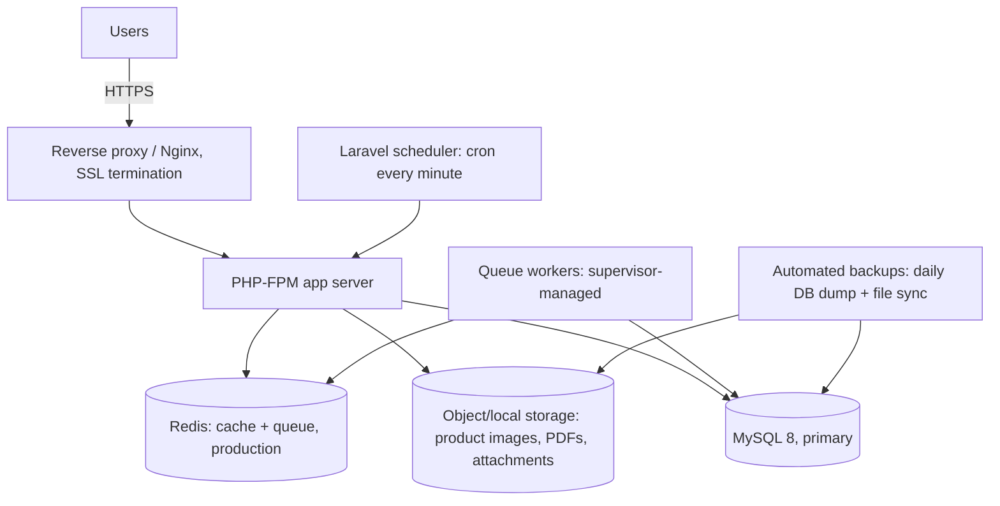

# Testing Strategy & Production Deployment Architecture

## 1. Automated tests (spec §90–92, run after every phase per rule 27)

| Area | Required tests |
|---|---|
| Auth | register, login, logout, password reset |
| Multi-tenancy | **TenantIsolationTest** — release blocker (§73), see [02-multitenancy.md](02-multitenancy.md) §6 |
| Products | create, edit, stock movement creates ledger row + updates cached quantity |
| Orders | create via Fast Sale, server-side total recalculation (client-tampered totals rejected), status transitions logged |
| Payments | create, confirm, refund, order/invoice balance updates correctly |
| Invoices | create, sequential numbering per business (`INV-2026-000001` uniqueness under concurrent creation) |
| Delivery | rider assignment, status transitions logged, rider cannot see other riders'/businesses' deliveries |
| Subscriptions | trial starts on registration, trial expiry restricts paid-only features without deleting data, plan feature limits enforced (e.g. exceeding `max_products`) |
| API | same coverage as web for every `/api/v1` resource, token scoped to one business rejected on another |
| Acceptance | full §91 journey (register → business → product → customer → sale → payment → invoice → receipt → delivery → dashboard) as one feature test |

Test types: Feature tests (HTTP + DB) are primary; Unit tests for `Money`, `CompleteSaleAction`, `RecalculateOrderTotalsAction`, and each Service. Use model factories/seeders (spec rule 21) — the existing `UserFactory` is extended; new factories added per model as it's built.

## 2. Environments

- **Local**: WAMP/XAMPP/Herd/Linux — MySQL 8, `QUEUE_CONNECTION=database` (no Redis dependency required locally), `.env` copied from an updated `.env.example` (adds `WHATSAPP_*`, `AI_*` per spec §88).
- **Staging**: mirrors production, seeded with the `MO Essentials` demo business (spec §86) for QA/demoing.
- **Production**: `app.mauzofasta.co.tz` (application) + `mauzofasta.co.tz` (marketing) + public stores under `mauzofasta.co.tz/shop/{slug}`.

## 3. Production deployment architecture

- Queue workers run under Supervisor (or systemd), one for the default queue and one for a `whatsapp`/`pdf`/`reports` queue if volume warrants separating them later — not needed at MVP scale.
- Scheduler drives: subscription trial-expiry checks, overdue-invoice flagging, low-stock alert generation, abandoned-cart cleanup, `store_visits` pruning.
- Backups: daily DB dump + file backup, retained daily/weekly/monthly per spec §76; restoration steps documented in `docs/20-backups.md` once Phase 14 is reached.
- Logging: `stack` channel to file + external error tracking (Sentry-compatible, configured via env, optional) — never logs passwords, tokens, or payment credentials (spec §77).
- Monitoring: queue failure alerting (`failed_jobs` table watched), uptime check on `app.mauzofasta.co.tz` and marketing site.

Full deployment runbook is written at Phase 14 once the app exists to deploy; this section defines the target shape so Phase 1 infrastructure choices (queue driver, storage disk config, session driver) are made consistently with it from the start.

**Known gotcha (found in Phase 1, local WAMP install):** don't assume a new MySQL
server's `default_storage_engine` is InnoDB — one WAMP install encountered during
development had it set to MyISAM via `my.ini`, which silently broke every foreign
key and hit MyISAM's 1000-byte key length cap on the very first migration.
[config/database.php](../config/database.php) now forces `'engine' => 'InnoDB'`
on the `mysql` connection explicitly, so this is already handled — but it's worth
a sanity check (`SHOW TABLE STATUS`) after provisioning any new environment.
